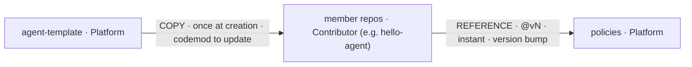

# 图灵星球 Agent 军团 — Agent Legion

A multi-agent, **MCP-based** platform. Contributors write business logic in their own repos; the platform owns the rails (scaffold template, the one review agent, CI/CD, the gateway). **This repo is the front door** — start here to understand how the pieces fit, then jump to the repo you need.

**Core mental model:** *3 artifacts · 2 propagation paths · 4 levers · 4 constants · 2 onboarding paths · 1 promotion path.* Almost everything is changeable as **data** inside a repo's **manifest**; the platform owns the rails.

## The three repos, and how change flows between them

| Repo | Role | Owner | How change reaches it |
| --- | --- | --- | --- |
| **[policies](https://github.com/turingplanet/policies)** | The logic: the one review flow + the one standing review agent | Platform (`turingplanet`) | members **REFERENCE** it as `@vN` — a bump reaches the whole fleet instantly |
| **[agent-template](https://github.com/turingplanet/agent-template)** | The scaffold: manifest schema + thin workflow pointer | Platform (`turingplanet`) | **COPIED** once into a new member at creation, then detaches |
| **[hello-agent](https://github.com/enochhz/hello-agent)** *(private example)* | Example member repo: business logic (`/api` + `/mcp`) + filled manifest | Contributor (`enochhz`) | references `policies@vN`; the first proof of the loop |

- **COPY** (template → member): slow, one-time at creation; updating live repos is a codemod campaign.
- **REFERENCE** (member → policies, `@vN`): instant; one version bump reaches everyone.

## The seam: the manifest

Every member repo carries an **`agent.manifest.yaml`** at its root — the one fixed **anchor**. It declares toolchain, paths, and commands. Both the review agent and the deterministic CI steps read from it, so structure and tooling change as *data* without ever touching the agent.

## What never changes — the 4 constants

1. **One standing review agent** — platform-owned, reads the manifest, never forked.
2. **One review flow** — read manifest → install/declared tests → checks → gate decides.
3. **The gate decides; the LLM advises** — a green build is the judge, never the model's confidence.
4. **One fixed anchor** — the manifest's name/location; the only hardcoded thing anywhere.

## Where to go next

- **Just want the map?** You just read it.
- **Building an agent?** Start from **[agent-template](https://github.com/turingplanet/agent-template)** — copy it, fill `/api` + `/mcp` + the manifest, open a PR. You're on the standard rails.
- **Want the rails / review logic?** See **[policies](https://github.com/turingplanet/policies)**.
- **Want a working example?** See **[hello-agent](https://github.com/enochhz/hello-agent)**.

## Status

**Architecture 1** (develop → review → deterministic gate) is proven end-to-end: a member PR runs the full flow — manifest → setup toolchain → install → tests → contract → lint → security → AI advisory → **gate decides** — and goes green with every declared check actually executing. **Architecture 2** (build / release) and **Architecture 3** (the MetaMCP gateway runtime) are next.

## Full design

The complete architecture design lives in Notion: _<add your Notion share link here>_.
(Prefer it in-repo? It can be committed as `docs/architecture-design.md`.)
