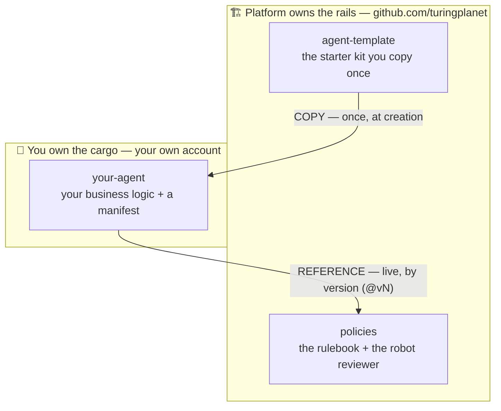
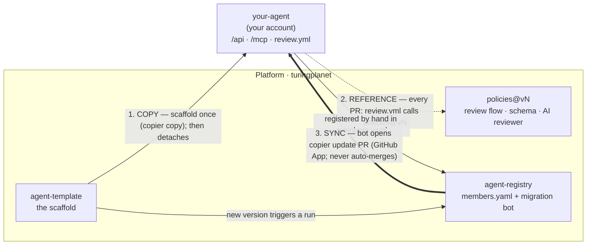
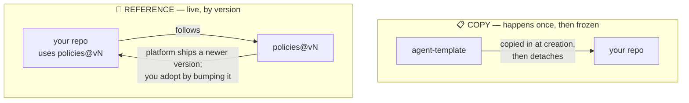
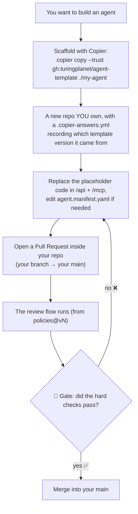
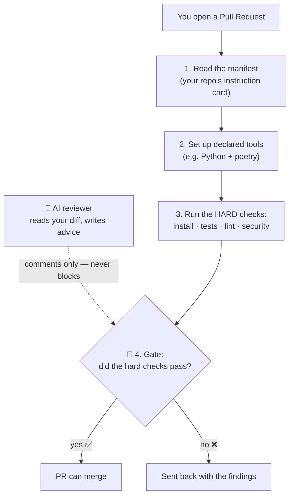
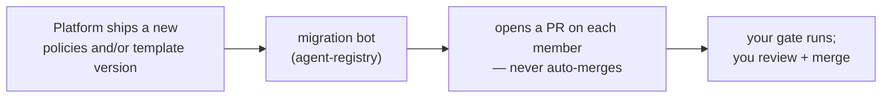

# 图灵星球 Agent 军团 — Agent Legion

A platform for building and running lots of small AI agents (served over **MCP**). The whole idea in one sentence:

> **You write your agent's code in your own repo. The platform gives you the shared machinery — a starter kit, an automatic reviewer, and a place to run.**

If a word here ever feels like jargon, jump to the **[plain-language glossary](#plain-language-glossary)** at the bottom.

## Which one are you? (pick your path)

| | you want | your first command | your full guide |
|---|---|---|---|
| 👀 **Just curious** | try a live agent — install nothing | `claude mcp add --transport http legion-demo https://agent-demo.turingplanet.ai/mcp` | [agents.turingplanet.ai](https://agents.turingplanet.ai) |
| 🆕 **Starting from scratch** | a working agent in minutes | `copier copy --trust gh:turingplanet/agent-template ./my-agent` | [agent-template quickstart](https://github.com/turingplanet/agent-template#readme) |
| 📦 **Have an existing project** | adopt the platform *around* your code — nothing moved, rewritten, or deleted | `curl -fsSL https://raw.githubusercontent.com/turingplanet/agent-template/main/detect.sh \| bash` *(inside your repo)* | [MIGRATE.md](https://github.com/turingplanet/agent-template/blob/main/MIGRATE.md) — written to be handed to your AI |
| 🚀 **Built it, want the perks** | fleet sync + free `/review` + hosting at `you.agents.turingplanet.ai` | install the App: [github.com/apps/fleet-migration-bot](https://github.com/apps/fleet-migration-bot), then comment `/register` on any PR | [Joining the fleet (§6)](#6-joining-the-fleet--the-whole-setup-in-two-lines) · [platform hosting](https://github.com/turingplanet/agent-registry#readme) |

Each guide is the single source of truth for its path — the sections below explain *how the machine works* rather than *what to type*.

## 1. The big picture: three repos

There are only **three** repositories, and each has one job:



The platform team owns the first two (**the rails**); you own the third (**the cargo**).

## The repos & the three actions, at a glance

§1 is the member's-eye view — two rails plus your repo. Zoom out to include the platform's maintenance repo (**agent-registry**), and the whole system is just **three actions** connecting the repos:



<details>
<summary>Plain-text / terminal version (same diagram, no Mermaid needed)</summary>

```text
PLATFORM (turingplanet):  agent-template  ·  policies@vN  ·  agent-registry
YOU:                      your-agent   (/api · /mcp · review.yml)

(1) COPY ....... once, you run it
    agent-template  ──copier copy──▶  your-agent          (then detaches)

(2) REFERENCE .. every PR, live, automatic
    your-agent  ···review.yml @vN···▶  policies@vN         (gate runs in YOUR CI)

(3) SYNC ....... maintenance, the platform pushes
    agent-registry bot  ══copier-update PR══▶  your-agent
                        (reads members.yaml · GitHub App · never auto-merges)

plumbing:
    new agent-template version  ──▶  triggers a bot run
    your-agent  ──added by hand──▶  members.yaml           (so the bot knows you)

Only (3) pushes to your repo — and only as a PR you merge.
(1) is a pull you start; (2) is your CI reaching OUT to policies — it never reaches in.
```
</details>

- **① COPY** — *one-time*: you run `copier copy`; the scaffold lands in your repo, then detaches. (→ §3)
- **② REFERENCE** — *every PR, live*: your `review.yml` calls `policies@vN` in your own CI — the gate runs there, nothing is pushed to you. (→ §4, §5)
- **③ SYNC** — *maintenance*: the agent-registry bot opens `copier update` PRs (policies-version bumps ride along too), authenticated by a GitHub App, never auto-merging. (→ §5)

**Only ③ ever _pushes_ to your repo — and only as a PR you merge.** ① is a one-time pull you start; ② is your CI reaching *out* to policies — policies never reaches *in*.

### The platform's own running services

The four repos above are **files**. Two more are **services the platform runs** — you never install them, but they're public so you can read exactly what they do:

| repo | what it does | when it touches you |
| --- | --- | --- |
| [fleet-router](https://github.com/turingplanet/fleet-router) | the edge router: one wildcard domain (`*.agents.turingplanet.ai`) whose Caddy routing table is generated from `agent-registry/deployments.yaml` | only if you opt into platform hosting — it's what serves `<your-slug>.agents.turingplanet.ai` |
| [fleet-services](https://github.com/turingplanet/fleet-services) | holds the platform's credentials (LLM key, GitHub App) so member CI never has to: runs `/review` (§7), self-service registration (`/register` or push, §6), and teardown (`scripts/teardown.sh`) | only when you ask — a PR comment, a push with `fleet.register: true`, or the teardown script |

Both follow the same rule as everything else: **they act with the platform's own credentials on the platform's own side**, and member repos only ever send public metadata (repo name, PR number). Nothing of yours is stored.

## 2. The two ways things connect: COPY vs REFERENCE

This is the one idea that makes everything else click. Repos connect to the shared ones in **two different ways**:



- **COPY** = a one-time photocopy. When you start, the **template** is photocopied into your repo. After that your copy is *yours* — if the template changes later, your copy does **not** change on its own.
- **REFERENCE** = a live link by version number. Your repo *points at* **policies** with a label like `@vN`. The platform can ship a newer version; you pick it up by bumping that version.

**Everyday version:** COPY is like photocopying a recipe card — your copy won't update when the original does. REFERENCE is like following a magazine by issue number — you choose which issue you read, and moving to the next issue is one small step.

## 3. How you build an agent (start here)

Each agent is its **own repo that you own**, scaffolded from `agent-template` with **[Copier](https://copier.readthedocs.io)**:



**Two things worth knowing:**

- **Copier remembers where your repo came from.** Scaffolding writes a `.copier-answers.yml` that pins the template version — which is what lets you later run **`copier update`** to pull new template changes as a PR (a 3-way merge: your code is preserved, conflicts come out as markers to resolve).
- **"Open a PR" = a PR inside *your own* repo.** You don't save changes straight to your `main`. You make a branch, then **open a pull request** (your branch → your `main`). Opening it starts the automatic review, and the gate decides whether it merges. It all happens in your repo — nothing is sent to the platform. (The same "review before you merge" habit you'd use with a human reviewer.)

## 4. What happens when you open a PR

Opening a PR runs the **review flow** — the steps come from `policies`, live:



The important part: **the gate decides, the AI only advises.** The automated checks (install, tests, lint, security) are the real pass/fail. The 🤖 AI reviewer reads your change and leaves comments, but it can *never* block your PR on its own. Green checks = you can merge.

## 5. How updates reach you

You're **pinned** to specific versions and **never force-updated** — old tags stay frozen, so nothing changes under you. You adopt when ready. And you don't have to watch for releases: updates arrive as a **PR on your repo** — that PR *is* the notification. You review it, your own gate runs on it, and you merge.



**If `policies` changes** (the review flow / reviewer — the **REFERENCE** side): your `review.yml` pins `policies@vN`, so a new version doesn't touch you until you bump it. Adopt by changing the version in `review.yml` (the `uses:@vN` line and its matching `policies_ref:` input). The migration bot makes that bump for you in a PR — or do it by hand anytime.

**If `agent-template` changes** (the starter files — the **COPY** side): the migration bot runs `copier update` on your repo and opens a PR with the new template files merged in — your `/api` + `/mcp` code is preserved. Or run `copier update` yourself.

**Either way:** nothing merges without you, and every update PR passes through your gate first. And if you've pushed manual fixes to a sync branch (say, resolving conflict markers), the bot **never overwrites them** — each new template version arrives on its own fresh branch. (The bot lives in [agent-registry](https://github.com/turingplanet/agent-registry) and reads the fleet list there.)

## 6. Joining the fleet — the whole setup, in two lines

Scaffolding and running an agent needs **nothing from us** — the template and the review flow are public, and the gate runs in your own CI. Joining the *fleet* (so the platform can keep you in sync and offer you extras) is exactly two steps:

1. **Install the platform's GitHub App** on your agent repo: **https://github.com/apps/fleet-migration-bot** — one click, and only the repo owner can do it (an App can't grant itself access).
2. **Get added to `members.yaml`** — a PR on [agent-registry](https://github.com/turingplanet/agent-registry) that a platform admin merges. The scaffold offers to open it for you.

That's it. Step 1 is the *keys*, step 2 is the *roster* — you need both, and neither can substitute for the other. (If a sync ever fails with `Not Found`, it's always step 1.)

What the two steps unlock:

| | |
| --- | --- |
| **Template syncs** | update PRs on your repo when a new `agent-template` ships — never auto-merged, always through your own gate |
| **Free AI review** | comment `/review` on any PR for a platform-paid security review (§7) |
| **Platform hosting** *(optional, admin-approved)* | your agent deployed and served at `<your-slug>.agents.turingplanet.ai` — add an entry to `deployments.yaml` |

Prefer to stay independent? Skip both steps. Your agent still works, still passes the same gate, and you can self-host it anywhere.

## 7. Free AI review on your PRs

Comment **`/review`** on a pull request in a registered repo and the platform's Claude posts a review — **paid for by the platform**, and **advisory only**: it never blocks, your gate decides.

| command | what it does |
| --- | --- |
| `/review` | security review (the default) |
| `/review security` \| `perf` \| `general` | pick the lens |
| `/review help` | full list + your remaining weekly quota |

Each repo gets a weekly allowance (`ai_review.weekly_limit` in `members.yaml`, set by an admin); `/review help` and declines don't count against it. GitHub doesn't autocomplete third-party commands — just type it as a normal comment.

## Common questions

| Question | Short answer | More |
| --- | --- | --- |
| **How do I generate a repo from the template?** | Scaffold with Copier (`copier copy --trust gh:turingplanet/agent-template ./my-agent`), push it as your own repo, smoke-test it, then write your code. | [§3](#3-how-you-build-an-agent-start-here) · [agent-template](https://github.com/turingplanet/agent-template) |
| **`policies` changed — do I update by hand? Will I be told?** | You're **pinned and never force-updated**. Adopt by bumping the version in your `review.yml` (the `uses:@vN` line **and** its matching `policies_ref:`). The migration bot opens that PR for you — **the PR is the notification** — or do it by hand anytime. | [§5](#5-how-updates-reach-you) · [policies](https://github.com/turingplanet/policies) |
| **The template changed — do I update by hand? Will I be told?** | The migration bot opens a `copier update` PR on your repo automatically (again, the PR is the notification); or run `copier update` yourself. Your `/api` + `/mcp` code is preserved either way. | [§5](#5-how-updates-reach-you) · [agent-template](https://github.com/turingplanet/agent-template) |

## Plain-language glossary

| You'll see… | It means… |
| --- | --- |
| **the platform / the rails** | the shared system everyone builds on (run by `turingplanet`) |
| **contributor / member** | you, building one agent on the system |
| **manifest** (`agent.manifest.yaml`) | an index card on your repo telling the system how to build & test it |
| **the anchor** | the fixed name + location of that card, so every tool can find it |
| **COPY** | photocopy the starter kit once; your copy then goes its own way |
| **REFERENCE** | link to the shared rules by version; bump the version to get updates |
| **`agent-template`** | the Copier template you scaffold a new agent from |
| **`policies`** | the shared rulebook + robot reviewer your repo links to |
| **member repo** | your own repo, with your code |
| **PR** (pull request) | a request to merge a change; checks run before it can merge |
| **the gate** | the automatic pass/fail (the tests are the judge; the AI just advises) |
| **`@vN`** | which frozen version of the shared rules your repo follows (e.g. `@v0.0.7`) |

## Where to go next

- **Want the rules / the reviewer?** → [policies](https://github.com/turingplanet/policies)
- **Want the starter kit?** → [agent-template](https://github.com/turingplanet/agent-template)
- **Want a worked example?** → [hello-agent](https://github.com/enochhz/hello-agent)
- **The fleet inventory + auto-migration bot?** → [agent-registry](https://github.com/turingplanet/agent-registry)
- **What runs `/review` (and holds the platform's keys)?** → [fleet-services](https://github.com/turingplanet/fleet-services)
- **What serves `*.agents.turingplanet.ai`?** → [fleet-router](https://github.com/turingplanet/fleet-router)
- **Want to test any scenario end-to-end from a terminal?** → [e2e walkthroughs](e2e/README.md) — copy-paste runbooks with expected outputs

## Status

- **Architecture 1 (build → review → gate): live.** A PR runs the full flow and the gate decides.
- **Architecture 2 (release / deploy) v1: live.** Platform-hosted deployment is config-driven: an approved entry in [agent-registry](https://github.com/turingplanet/agent-registry)'s `deployments.yaml` deploys the member to the platform's Railway project and serves it at **`<slug>.agents.turingplanet.ai`** (TLS included, zero DNS work per agent). Removing the entry is the kill switch. Members can equally self-host on their own Railway — platform hosting is optional and admin-approved.
- **Architecture 3 (the MCP gateway): seeded.** The fleet edge router that powers the platform subdomains is its first incarnation.
- **Next up:** the migration path for existing projects — design in [RFC 001](rfcs/001-migration-and-deploy.md).
