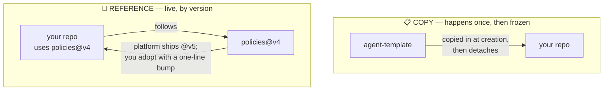
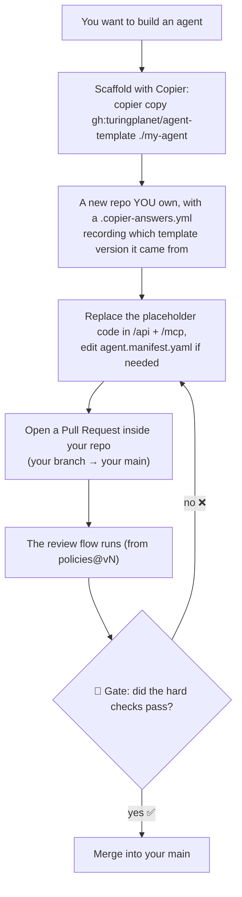
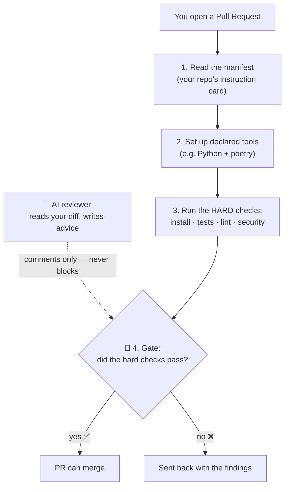
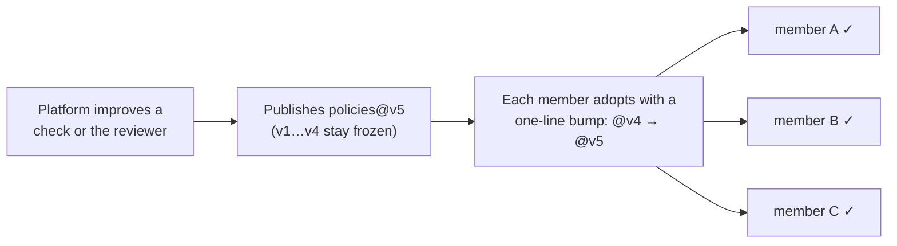

# 图灵星球 Agent 军团 — Agent Legion

A platform for building and running lots of small AI agents (served over **MCP**). The whole idea in one sentence:

> **You write your agent's code in your own repo. The platform gives you the shared machinery — a starter kit, an automatic reviewer, and a place to run.**

If a word here ever feels like jargon, jump to the **[plain-language glossary](#plain-language-glossary)** at the bottom.

## 1. The big picture: three repos

There are only **three** repositories, and each has one job:

The platform team owns the first two (**the rails**); you own the third (**the cargo**).

## 2. The two ways things connect: COPY vs REFERENCE

This is the one idea that makes everything else click. Repos connect to the shared ones in **two different ways**:

- **COPY** = a one-time photocopy. When you start, the **template** is photocopied into your repo. After that your copy is *yours* — if the template changes later, your copy does **not** change on its own.
- **REFERENCE** = a live link by version number. Your repo *points at* **policies** with a label like `@v4`. The platform can ship `@v5`; you pick it up by changing that one label.

**Everyday version:** COPY is like photocopying a recipe card — your copy won't update when the original does. REFERENCE is like following a magazine by issue number — you choose which issue you read, and moving to the next issue is one small step.

## 3. How you build an agent (start here)

Each agent is its **own repo that you own**, scaffolded from `agent-template` with **[Copier](https://copier.readthedocs.io)**:

**Two things worth knowing:**

- **Copier remembers where your repo came from.** Scaffolding writes a `.copier-answers.yml` that pins the template version — which is what lets you later run **`copier update`** to pull new template changes as a PR (a 3-way merge: your code is preserved, conflicts come out as markers to resolve).
- **"Open a PR" = a PR inside *your own* repo.** You don't save changes straight to your `main`. You make a branch, then **open a pull request** (your branch → your `main`). Opening it starts the automatic review, and the gate decides whether it merges. It all happens in your repo — nothing is sent to the platform. (The same "review before you merge" habit you'd use with a human reviewer.)

## 4. What happens when you open a PR

Opening a PR runs the **review flow** — the steps come from `policies`, live:

The important part: **the gate decides, the AI only advises.** The automated checks (install, tests, lint, security) are the real pass/fail. The 🤖 AI reviewer reads your change and leaves comments, but it can *never* block your PR on its own. Green checks = you can merge.

## 5. How platform improvements reach you

Because your repo **references** `policies` by version, rolling out an improvement is simple:

Old versions (`v1…v4`) stay frozen forever, so nothing breaks under you. You upgrade when you're ready by bumping one line. Template changes (the **COPY** side) are handled in the same spirit, automatically: the [agent-registry](https://github.com/turingplanet/agent-registry) **migration bot** runs `copier update` across the fleet and opens a PR per repo — never auto-merging, so each change still passes through your gate.

## Plain-language glossary

| You'll see… | It means… |
| --- | --- |
| **the platform / the rails** | the shared system everyone builds on (run by `turingplanet`) |
| **contributor / member** | you, building one agent on the system |
| **manifest** (`agent.manifest.yaml`) | an index card on your repo telling the system how to build & test it |
| **the anchor** | the fixed name + location of that card, so every tool can find it |
| **COPY** | photocopy the starter kit once; your copy then goes its own way |
| **REFERENCE** | link to the shared rules by version; bump the version to get updates |
| **`agent-template`** | the Copier template you scaffold a new agent from |
| **`policies`** | the shared rulebook + robot reviewer your repo links to |
| **member repo** | your own repo, with your code |
| **PR** (pull request) | a request to merge a change; checks run before it can merge |
| **the gate** | the automatic pass/fail (the tests are the judge; the AI just advises) |
| **`@v4`** | which frozen version of the shared rules your repo follows |

## Where to go next

- **Want the rules / the reviewer?** → [policies](https://github.com/turingplanet/policies)
- **Want the starter kit?** → [agent-template](https://github.com/turingplanet/agent-template)
- **Want a worked example?** → [hello-agent](https://github.com/enochhz/hello-agent)
- **The fleet inventory + auto-migration bot?** → [agent-registry](https://github.com/turingplanet/agent-registry)

## Status

Architecture 1 (build → review → gate) works end-to-end today: a PR runs the full flow and the gate decides. Architecture 2 (release / deploy) and Architecture 3 (the MCP gateway) are next.

## Full design

The complete architecture design lives in Notion: _<add your Notion share link here>_.
