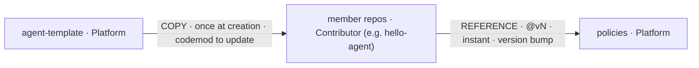

# 图灵星球 Agent 军团 — Agent Legion

A platform for building and running many AI agents, served over **MCP**. You write your agent's business logic in **your own repo**; the platform provides the shared machinery — a scaffold to start from, an automated reviewer that gates every change, and a gateway that serves your agent in production. **This repo is the front door** — start here, then jump to the repo you need.

**The one idea that makes it work:** your repo describes itself in a small **`agent.manifest.yaml`** (its language, folders, and commands). Because every platform tool reads that manifest, the platform adapts to your repo as *data* — onboarding a new kind of agent rarely means changing the platform itself.

## The three repos, and how change flows between them

| Repo | Role | Owner | How change reaches it |
| --- | --- | --- | --- |
| **[policies](https://github.com/turingplanet/policies)** | The logic: the one review flow + the one standing review agent | Platform (`turingplanet`) | members **REFERENCE** it as `@vN` — a bump reaches the whole fleet instantly |
| **[agent-template](https://github.com/turingplanet/agent-template)** | The scaffold: manifest schema + thin workflow pointer | Platform (`turingplanet`) | **COPIED** once into a new member at creation, then detaches |
| **[hello-agent](https://github.com/enochhz/hello-agent)** *(private example)* | Example member repo: business logic (`/api` + `/mcp`) + filled manifest | Contributor (`enochhz`) | references `policies@vN`; the first proof of the loop |

- **COPY** (template → your repo): happens once, when you create your repo; the copy is detached, so later template changes don't touch you (a platform-run codemod does that).
- **REFERENCE** (your repo → policies, `@vN`): your workflow points at the central flow by version; the platform bumps the version and the change reaches everyone at once.

## Onboarding: getting your own agent repo

You **don't fork** anything. Each agent lives in its **own independent repo that you own**.

**Greenfield — start fresh (the default):**
1. On **[agent-template](https://github.com/turingplanet/agent-template)**, click **"Use this template" → Create a new repository**. You get a brand-new repo you own, with the scaffold files and **no link back** to the template — a detached copy (the design's "COPY once, then detach"). This is **not a fork**.
2. In **your** repo, write your logic in `/api` + `/mcp` and fill in `agent.manifest.yaml`.
3. Make a branch and **open a pull request inside your own repo** (your branch → your `main`). That PR triggers the automated review — your repo *references* the central flow from `policies@vN`, the standing agent posts findings, and the **deterministic gate** decides whether the PR may merge. You're on the rails.

> **Why a PR, and why not a fork?**
> - The **PR is inside your own repo**, not a submission to the platform. It's just the unit the reviewer checks — the ordinary "don't push straight to `main`; go through a reviewed PR" discipline, except the reviewer is the standing AI plus the deterministic gate.
> - You never **fork**. You take a one-time **copy** of the template (Use this template), and you **reference** `policies` live by version (`@v1`) from your workflow file. A fork stays *linked* to its upstream for contributing changes *back* — which isn't what you're doing here.

**Brownfield — adopt an existing repo:** hand-write an `agent.manifest.yaml` describing your repo as it is today, add the thin pointer to `policies@vN`, run the agent in warn-only mode, then migrate to the contract. Same agent, same flow, no forking.

## The seam: the manifest

Every member repo carries an **`agent.manifest.yaml`** at its root — the one fixed **anchor**. It declares toolchain, paths, and commands. Both the review agent and the deterministic CI steps read from it, so structure and tooling change as *data* without ever touching the agent.

## What never changes — the 4 constants

1. **One standing review agent** — platform-owned, reads the manifest, never forked.
2. **One review flow** — read manifest → install/declared tests → checks → gate decides.
3. **The gate decides; the LLM advises** — a green build is the judge, never the model's confidence.
4. **One fixed anchor** — the manifest's name/location; the only hardcoded thing anywhere.

## Where to go next

- **Want the rails / review logic?** → **[policies](https://github.com/turingplanet/policies)**
- **Want the scaffold to start from?** → **[agent-template](https://github.com/turingplanet/agent-template)**
- **Want a worked example?** → **[hello-agent](https://github.com/enochhz/hello-agent)**

## Status

**Architecture 1** (develop → review → deterministic gate) is proven end-to-end: a member PR runs the full flow — manifest → setup toolchain → install → tests → contract → lint → security → AI advisory → **gate decides** — and goes green with every declared check actually executing. **Architecture 2** (build / release) and **Architecture 3** (the MetaMCP gateway runtime) are next.

## Quick recap (a mnemonic, once the terms click)

**3 artifacts** (template · policies · member repos) · **2 propagation paths** (COPY · REFERENCE) · **4 levers** (repo-data · central-logic · agent-behavior · the-anchor) · **4 constants** (one agent · one flow · gate decides · one anchor) · **2 onboarding paths** (greenfield · brownfield) · **1 promotion path** (staging → canary → production).

## Full design

The complete architecture design lives in Notion: _<add your Notion share link here>_.
(Prefer it in-repo? It can be committed as `docs/architecture-design.md`.)
