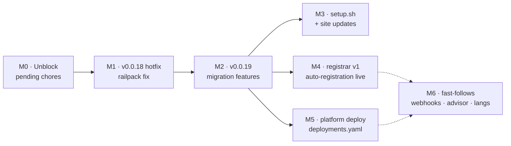

# RFC 001 — Implementation plan

**Companion to:** [RFC 001 — Migration wizard & platform deploy](001-migration-and-deploy.md) · **Date:** 2026-08-02
**Purpose:** review-and-approve ordering doc. Each milestone is independently shippable and ends with a verification gate. Effort is in working sessions (one focused sitting with Claude).

---

## Milestone map

M3/M4/M5 are parallel after M2 — pick by appetite. Dotted = only on demand.

---

## M0 — Unblock (½ session) — *do first, blocks everything*

Pending items that interact badly with any new release:

- [ ] **Merge the two v0.0.9 sync PRs**: [test-agent-2#2](https://github.com/turingplanet/test-agent-2/pull/2), [hello-agent#8](https://github.com/enochhz/hello-agent/pull/8). ⚠️ A bot run before these merge force-pushes `chore/template-sync` and destroys hello-agent#8's hand-resolution (bot cron: **Mondays 06:00 UTC** — check the calendar before starting).
- [ ] **Grant fleet App access on `enochhz`** (Settings → Applications → fleet-migration-bot → All repositories). Without it, syncs on my-agent/my-agent3 keep failing `Not Found`.
- [ ] **Delete the accidental `sparkling-ambition` Railway project** (staged Redis/Postgres/bucket — possible billing).
- [ ] Register `legion-demo` in `members.yaml` (it's the flagship; it should be a fleet member).

**Done when:** both PRs merged · a manual bot run goes green across all members · Railway shows no stray project.

## M1 — agent-template v0.0.18: railpack hotfix (½ session)

Ship the deploy fix **alone and immediately** — every new scaffold currently crashes on Railway (Railpack's mise poetry 2.4.1 is missing `libexpat.so.1`). Separating it from feature work means the fix reaches members this week, not when migration lands.

- [ ] `railpack.json` startCommand → `python mcp_server/server.py` (fix proven live on legion-demo).
- [ ] Tag `v0.0.18`, trigger bot run → fleet-wide PRs.

**Done when:** a fresh scaffold deploys green on Railway · fleet PRs merged.

## M2 — agent-template v0.0.19: migration features (2–3 sessions) — *the core*

Implements RFC §3–§4, §7, §10 (template side).

- [ ] **`adopt_mode`** copier question + conditional generation: seam files only (`agent.manifest.yaml`, `.copier-answers.yml`, `review.yml`, `mcp_server/`, `config.py`, `railpack.json`); skip `api/`, `tests/`, `pyproject.toml` when adopting. Manifest build/test commands become editable questions.
- [ ] **`fleet.register` manifest field**, set by the existing explicit yes/no copier question; **delete the `github_repo` question** (no longer needed — see register.yml).
- [ ] **`register.yml`** push-workflow: reads the flag + `github.repository`; calls the registrar; **exits 0 quietly if the registrar doesn't exist yet** (lets this ship before M4). `register-in-fleet.sh` demoted to manual fallback.
- [ ] **`detect.sh`**: language/stack, MCP deps, `mcp/`-dir collision check, gitleaks if installed → prints scenario + recommendation (RFC §4 preflight).
- [ ] **`MIGRATE.md`**: opens with the 5-scenario decision table (RFC §3), per-scenario runbook, written to be handed to Claude Code; includes the going-public history-hygiene checklist.
- [ ] README updates (scaffolded + root): "have an existing project?" pointer.

**Verify (the gate for this milestone):**
- [ ] Fresh scaffold: pytest ✓ · stdio round-trip ✓ · HTTP `/mcp`+`/api` ✓ · gate green ✓.
- [ ] **Adoption fixture**: a fake "existing FastAPI repo" → `adopt_mode` → wire one tool → gate green. Keep the fixture repo; it becomes the permanent regression test for migration.
- [ ] `copier update` from a v0.0.17 member is a clean 3-way merge.

**Done when:** all three verifications pass · tagged `v0.0.19` · bot run green.

## M3 — setup.sh + site (1 session)

- [ ] `setup.sh` in agent-legion `docs/` (served at `agents.turingplanet.ai/setup.sh`): prereq check → pipx-install copier → fresh dir: scaffold · existing repo: run `detect.sh`.
- [ ] Site: quickstart gains the one-liner; new "Have an existing project?" section linking MIGRATE.md.
- [ ] Verify in a clean container/VM: `curl -fsSL … | bash` both modes.

## M4 — Registrar v1 (1–2 sessions) — *activates M2's register.yml*

Implements RFC §10 v1. **Recommendation: a dedicated tiny `registrar` service, scaffolded from your own template** (dogfooding), *not* piggybacked on legion-demo — the registrar holds a credential that can write to agent-registry, and the public demo agent is the wrong place for that blast radius.

- [ ] `POST /api/register {repo}`: validate repo exists + its manifest says `register: true` (read via GitHub API); idempotent vs `members.yaml` + open PRs; simple rate limit.
- [ ] Opens the members.yaml PR with a platform App token (App needs contents+PR write on agent-registry — config, not code).
- [ ] Deploy to Railway (platform account).
- [ ] End-to-end: scaffold → push to a throwaway repo → PR appears on registry → admin merges → bot syncs it.

**Done when:** a stranger-shaped test account can go scaffold→push→registered with zero manual steps besides your merge.

## M5 — Platform deploy: deployments.yaml (2–3 sessions)

Implements RFC §5. Independent of M3/M4.

**Domain experiment results (2026-08-02, live test with `test.agents.turingplanet.ai` on legion-demo):**
Railway requires a **per-subdomain TXT verification record** and assigns a **unique CNAME target per domain** — so per-agent custom domains would force Namecheap-API automation into the workflow. Worse, the account's **custom-domain plan limit was hit at ~3 domains**. Per-agent domains do not scale.

**Revised design — one wildcard domain, one edge router:** attach the single wildcard custom domain `*.agents.turingplanet.ai` to **one router service** in the `agent-fleet` project; the router forwards by hostname to member services over Railway **private networking** (`<slug>.railway.internal`). One DNS setup, one TXT, one domain slot, unlimited subdomains — and the router is the seed of Architecture 3's MetaMCP gateway. The deploy workflow then never touches DNS: deploy member service → update the router's routing table.

- [x] **Separate Railway project** for fleet hosting: `agent-fleet` (created 2026-08-02, empty).
- [x] Clean up the experiment: `test.agents.turingplanet.ai` deleted from legion-demo + Namecheap records removed (verified via DNS, 2026-08-02). `FLEET_RAILWAY_TOKEN` (workspace-scoped) stored as an agent-registry secret and validated against the GraphQL API.
- [ ] Router service in `agent-fleet` (Caddy or a small FastAPI/uvicorn proxy, scaffolded from our own template): hostname → `<slug>.railway.internal` routing table from a config file.
- [ ] One-time DNS: wildcard `*.agents.turingplanet.ai` CNAME to the router's Railway target + its single TXT verification.
- [ ] `deployments.yaml` schema (`host: platform | dns-only`, slug, limits) in agent-registry.
- [ ] Deploy workflow (dispatch + cron): per approved entry → checkout member main at a **gate-green commit** (commit status API) → `railway up` into agent-fleet → add slug to the router table. Entry removed → undeploy + route removed (kill switch).
- [ ] `dns-only` mode: explicit CNAME record to the member's own Railway (per-domain TXT applies — acceptable at dns-only volumes).
- [ ] Pilot: platform-host `hello-agent` end to end at `hello.agents.turingplanet.ai`.

**Done when:** one member is live on a platform subdomain via the workflow, and deleting its entry takes it down.
**Open item:** router adds a hop — measure MCP streaming latency through it during the pilot; upgrade plan + per-agent domains remains the fallback if proxying MCP proves problematic.

## M6 — Fast-follows (build only on demand)

- Webhook receiver — **one service, two features**: App-install-as-registration (RFC §10 v2) + instant platform CD (RFC §5.4).
- Platform advisor LLM tool (RFC §4) — has ongoing cost + abuse surface; wait for members to ask.
- `agent-template-<lang>` siblings — wait for a real non-Python member; first one is us testing the gate (RFC §3-D).

---

## Decision points for your review

1. **Two releases (M1 hotfix + M2 features) vs one big v0.0.18** — plan recommends two: the deploy crash is live today and shouldn't wait on feature work. ✅/❌
2. **Registrar as dedicated service vs on legion-demo** — plan recommends dedicated (credential blast radius). Costs one more Railway service. ✅/❌
3. **M4 vs M5 order** — plan lists registrar first (it completes the member funnel; deploy serves existing members). Flip if platform hosting is the more urgent community ask. ✅/❌
4. **Fixture repo for migration testing** — plan makes it permanent CI collateral. Name it `migration-fixture`? ✅/❌

## Standing risks

- **Sequencing with the bot cron** (Mondays 06:00 UTC): never release mid-cycle with unmerged sync PRs open.
- **Railpack drift**: Railway changed runtime behavior once already (M1's bug); pin what's pinnable, keep legion-demo as the canary.
- **Platform hosting = member code on our account** (RFC §5.5): limits mandatory, approval human, start with known members.
- **Registrar spam** (RFC §11): v1 ships simple; PRs are inert until merged.

**Total to a fully-shipped RFC: ~7–10 sessions.** Minimum lovable subset: **M0 + M1 + M2** — migration works with manual registration and self-hosted deploys, everything else is acceleration.
