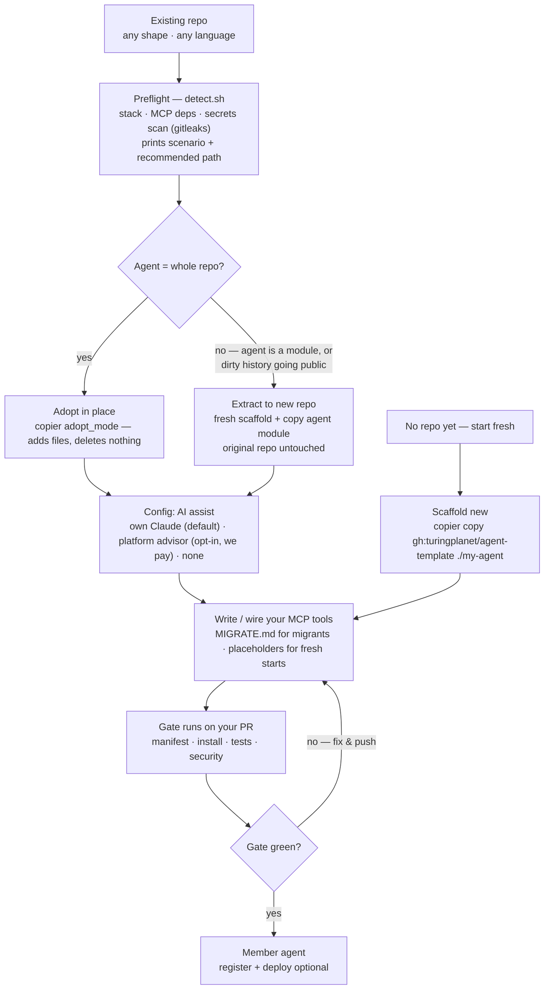
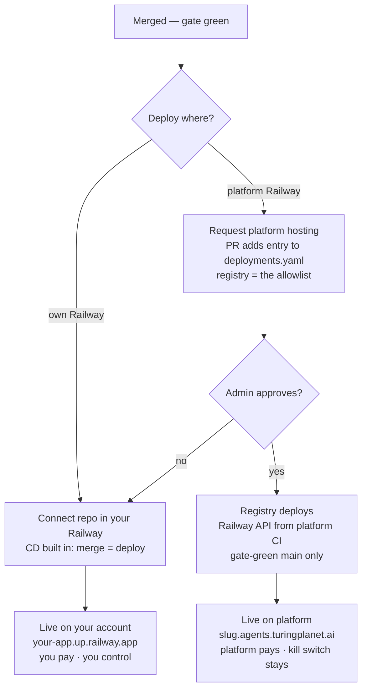

# RFC 001 — Migration wizard & platform deploy (Architecture 2)

**Status:** draft for discussion · **Author:** Hao + Claude · **Date:** 2026-08-02
**Implements:** onboarding for existing projects (migration/adoption) + post-merge deployment (the roadmap's Architecture 2).

---

## 1. Problem & goals

Community members fall into two groups: those with **no repo** (served today by `copier copy`) and those with an **existing project** they want to bring into the fleet. For the second group we need a migration path that:

- never destroys or silently rewrites their code,
- works across repo shapes (full-stack, API-only, MCP-already, non-Python),
- gives optional AI assistance — configurable between **their own LLM** (free to us, code stays local) and a **platform-paid LLM** (opt-in, we pay),
- ends in the same place as every member: gate-green, optionally registered, optionally deployed,
- and, for deployment, lets members choose **their own Railway** or **platform-hosted Railway with a `*.agents.turingplanet.ai` subdomain** — where the **registry controls who may use platform assets**.

## 2. Principles this design inherits (do not re-litigate)

1. **The manifest is the contract, not folder layout.** The gate runs whatever `agent.manifest.yaml` declares; nothing needs relocating.
2. **The gate decides, the AI advises.** Detection and validation are deterministic; LLMs only assist.
3. **Additive is automated; bespoke is assisted; everything is verified.** Copier adds files, never rewrites code. Wiring functions into tools is judgment — done by the member (or their AI following `MIGRATE.md`), verified by the gate.
4. **Secrets never cross accounts.** Platform API keys and Railway tokens cannot live in member repos. Anything platform-paid must run platform-side (hosted advisor, registry-driven deploys).
5. **Provenance is a file.** `.copier-answers.yml` makes migrated repos indistinguishable from scaffolded ones — the bot needs no changes.
6. **Every authorization is a PR.** Fleet membership (`members.yaml`) and platform hosting (`deployments.yaml`) are granted by admin-merged PRs, revoked by one-line diffs.

## 3. Scenarios

| # | You have | The move | You get | Notes |
|---|---|---|---|---|
| 0 | Nothing — starting fresh | `copier copy` scaffold | Runnable agent in minutes | Today's quickstart, unchanged |
| A | Full-stack repo (frontend + backend) | Adopt in place scoped by manifest, **or** extract agent module to new repo | Backend gains `/mcp`; frontend untouched | Extract when the agent is a *component* of a product, or when secret-laden history must go public |
| B | API-only (Python) | `adopt_mode` scaffold; wire funcs as tools | Same app, two doors: `/api` kept, `/mcp` added | The mainstream case |
| C | Own MCP server (Python) | Seam-only adoption (manifest + review.yml + provenance) | Instant member, zero rewrite | Must rename any folder literally named `mcp/` (shadows the SDK) |
| D | MCP in TS / Go / Java / … | Seam-only; manifest declares their stack's commands | Rails without the kit: gate + sync + fleet | Rails are language-agnostic; scaffold is Python-first. First non-Python member should be us (test the gate!) |

**Key asymmetry:** the more MCP-native a repo already is, the *fewer* files adoption adds. Scratch is just the degenerate case that skips preflight entirely.

## 4. Master flow



Notes:

- **Preflight is deterministic** (`detect.sh`, ships in the template): greps for MCP deps, frontend frameworks, language, an `mcp/` dir; runs `gitleaks detect`. Prints the scenario, recommended destination, and a security summary — free, local, no LLM.
- **Both destination paths are non-destructive.** In-place adoption only *adds* files (copier collisions surface as conflict markers, resolved by the member). "Extract" copies code *out*; the original repo is never modified.
- **The AI-assist knob** (`own | platform | none`): "platform advisor" cannot run in member CI (principle 4) — it is a hosted MCP tool on a platform agent, opt-in with explicit disclosure that code is sent to us, rate-limited. Default is the member's own AI: `MIGRATE.md` is written to be handed to Claude Code as a runbook.
- **Migration itself is a PR through the member's own gate** — same trust shape as SYNC; reviewable, revertible, nothing new to trust.
- **Going-public checklist:** history is only a risk at the moment a private repo flips public. `detect.sh`'s gitleaks report + "rotate, don't rewrite" guidance gates that step.

## 5. Deploy phase (Architecture 2)



### 5.1 Why the platform lane is a *pull*, not a push

Platform Railway tokens cannot be given to member repos (principle 4 — a member could exfiltrate the token and deploy anything on our bill). So platform deploys run **platform-side, in agent-registry CI**, where the token lives as a repo secret and never leaves. The registry *pulls* approved repos and deploys them — the same shape as the migration bot, pointed at Railway.

### 5.2 `deployments.yaml` — the allowlist is the infrastructure

```yaml
# agent-registry/deployments.yaml
- repo: enochhz/hello-agent
  host: platform            # platform | dns-only
  domain: hello.agents.turingplanet.ai
  limits: { memory: 512MB, replicas: 1 }
```

- Requesting hosting = a PR adding your entry; **admin merge = authorization**. No entry, no deploy.
- The deploy workflow reads this file, checks out each repo's **main at a gate-green commit only**, and drives the Railway API. Declarative YAML + API calls = enough IaC for v1; Terraform can come later if state management ever warrants it.
- Removing an entry undeploys: a **one-line-diff kill switch**.
- `host: dns-only` grants a branded subdomain to a *self-hosted* member (CNAME to their Railway) — brand + discoverability at zero compute cost, still registry-controlled.

### 5.3 Domains

One wildcard CNAME in Namecheap (`*.agents.turingplanet.ai` → Railway), added once; the deploy workflow attaches `slug.agents.turingplanet.ai` per service via API.

### 5.4 CD triggers

- **Own lane:** already exists — Railway's GitHub integration redeploys on every push to main. Document, don't build.
- **Platform lane v1:** cron + manual `workflow_dispatch` (same rhythm as the migration bot). Fast-follow: fleet GitHub App push-webhooks → instant deploys.

### 5.5 Risks

Platform hosting runs **member code on our account**: egress wears our name, costs are ours. Mitigations: approval is a genuine human trust decision, per-service resource limits are mandatory in the schema, start with known members, kill switch stays one diff away.

## 6. Configurable knobs (all recorded in `.copier-answers.yml` / registry files)

| Knob | Values | Default | Who controls |
|---|---|---|---|
| `destination` | in-place · new-repo | recommended by `detect.sh` | member |
| `ai_assist` | own · platform · none | own (code stays local) | member; platform side rate-limited |
| `deploy` | own · platform · dns-only · none | own | member requests; **registry approves** |

Every default is the self-sovereign option; every platform option is granted by a registry PR.

## 7. Tooling decision: Copier stays the engine

`setup.sh` does **not** replace Copier — a bash scaffold has no provenance (`.copier-answers.yml`) and no 3-way-merge update path, the exact flaws that retired the "Use this template" button. Roles:

- **Copier** — scaffold + update engine (questions, conditional `adopt_mode` generation, Jinja, `copier update`).
- **bash** — glue only: `detect.sh`, `register-in-fleet.sh`, and the bootstrap one-liner
  `curl -fsSL https://agents.turingplanet.ai/setup.sh | bash`
  (checks prereqs, installs copier via pipx, runs scaffold — or `detect.sh` when run inside an existing repo).
- **`MIGRATE.md`** — the AI-runnable runbook (scenario decision table up top).
- **The existing gate** — verification. No new validator.

## 8. Components to build, in order

1. **agent-template v0.0.18** — `adopt_mode` (conditional generation) · destination/AI-assist copier questions · `detect.sh` · `MIGRATE.md` · the pending `railpack.json` startCommand fix (Railpack's poetry runtime broke; legion-demo carries the fix, the template doesn't yet).
2. **`setup.sh`** hosted on the site (bootstrap + detect).
3. **agent-registry: `deployments.yaml` + deploy workflow** (Railway API, wildcard domain attach, cron + dispatch). *First registry change in this design.*
4. **Platform advisor** MCP tool on a platform-hosted agent — only if members actually ask for platform-paid assist; it has ongoing cost + abuse surface.
5. **Nothing in policies.**

## 9. Open questions

- Extract path: auto-create the new GitHub repo (`gh` magic) or generate locally and let the member push? **Recommendation: manual push for v1** — consistent with "you own every outward action."
- Non-Python: when demand appears, sibling `agent-template-<lang>` sharing the same manifest schema — never stretch the Python template.
- Platform-lane instant CD via App webhooks — v2.
- Advisor privacy wording ("code sent to us, not stored") — needs exact copy before launch.
