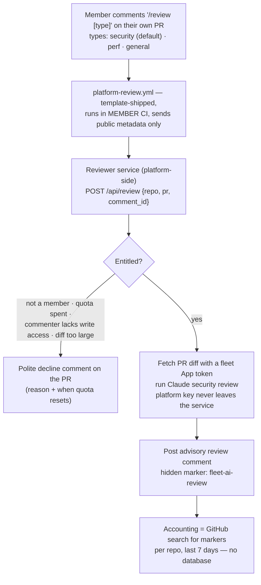

# RFC 002 — Platform-paid on-demand AI security review

**Status:** ✅ IMPLEMENTED + piloted live 2026-08-04 · **Date:** 2026-08-03
**One-liner:** a member comments `/review [security|perf|general]` on their PR; the platform's own Claude reviews the diff and replies as a PR comment — platform-funded, quota-controlled by the registry, advisory only. Security is the flagship type and the default.

## 1. Problem

The existing AI reviewer in the gate is **member-key-funded** (`ANTHROPIC_API_KEY` in the member's repo secrets, skipped when unset) — most community members won't have a key. We want a platform-funded alternative that members can invoke on demand, with the platform controlling cost (per-repo weekly quota + global budget).

## 2. Principles applied (all pre-decided — see design-qa.md)

1. **Secrets never cross accounts** → the platform's Anthropic key and App credentials live only in a platform-side service; member CI transmits public metadata only.
2. **The gate decides, the AI advises** → the review is a PR comment, never a blocking check — even though the platform pays for it.
3. **The registry is the entitlement store** → quotas are admin-merged YAML, like `members.yaml` roster and `deployments.yaml` hosting.
4. **GitHub is the database** → usage accounting = counting the service's own marked comments; no state infrastructure.

## 3. Flow



## 4. Components

### 4.1 Trigger — `platform-review.yml` (template, ~15 lines)
`on: issue_comment (created)`; proceeds only when the comment is on a PR and starts with `/review`; POSTs `{repo, pr_number, comment_id}` to the reviewer endpoint — the **review type is parsed server-side** from the comment body, so adding new types later (docs, tests, …) is a service-only change with no template release; **exits 0 quietly if the endpoint doesn't exist yet** (ships before the service, same forward-compat pattern as `register.yml`). v2: retire it — the M6 webhook receiver subscribes the fleet App to comment events, so the trigger needs nothing in member repos at all.

### 4.2 Reviewer service (platform-side; shares a home with the M4 registrar)
Both endpoints hold privileged credentials and follow "receive public metadata → act platform-side" — build them as **one small platform service** (dedicated, not on legion-demo, per the registrar blast-radius decision). Validation order for `/api/review`:

1. `repo` is in `members.yaml` (registry = who's entitled at all).
2. `comment_id` really exists on that PR, body starts with `/review` (type parsed from the remainder; unknown type → decline listing valid types), and the author's `author_association` is OWNER/MEMBER/COLLABORATOR — closes the "curl the endpoint to burn someone's quota" hole.
3. Quota: count marked comments in that repo over the trailing 7 days < `weekly_limit` (member-specific or platform default). Also enforce a **global weekly cap** across the fleet (platform budget backstop) — same search, unscoped.
4. Diff size cap (e.g. ≤ 3,000 changed lines) — oversized PRs get a "narrow it down" decline rather than a truncated bad review.

Then: fetch the diff via a fleet App installation token → one Claude call (**top-tier Claude, pinned in service config** — quality over cost per the 2026-08-03 decision; quota is the cost lever) with the type's prompt (security/perf/general personas) → post the review comment via the App with the hidden marker → done. Declines are also comments, stating the reason — and a quota-exhausted decline includes the governance path: *"to raise your limit, open a PR bumping `ai_review.weekly_limit` for your repo in members.yaml"* — the limit doubles as a governance touchpoint. Silent failure is banned (design-qa).

### 4.3 Quota config — `members.yaml` extension

```yaml
- name: hello-agent
  repo: enochhz/hello-agent
  ai_review:
    weekly_limit: 3     # absent or 0 = feature disabled for this repo
```

Platform default (proposed: 2/week) applies when the key is absent but the feature is globally enabled; per-member overrides are admin-merged PRs. The service needs read access to the (private) registry: grant the fleet App `agent-registry` in the turingplanet installation — config, not code, and the M4 registrar needs the same grant anyway.

## 5. Security & cost posture

- **Reviewed code is untrusted input.** The prompt must treat the diff strictly as data to analyze; instructions inside the diff are findings ("this code attempts prompt injection"), never commands. Advisory-only design bounds the blast radius: worst case is a bad comment.
- **Privacy disclosure** (same as the migration advisor, RFC 001): the command's response footer states "your diff was sent to the platform's LLM for this review; not retained."
- **Cost levers**, cheapest first: per-repo quota → global cap → diff cap. Model is deliberately NOT a cost lever (top tier, pinned): a review program is only as trusted as its worst review, so quality is fixed and volume is the dial. Quota counts ALL review types against one `weekly_limit`.
- The platform's key never appears in any member-visible surface; App tokens are minted per-request and expire.

## 6. Relationship to the existing gate AI reviewer

Two tiers of the same principle:

| | Gate reviewer (exists) | Platform reviewer (this RFC) |
|---|---|---|
| Runs | every PR automatically | on demand (`/review [type]`) |
| Pays | member (their key; skipped if none) | platform |
| Cost control | member's own | registry quota + global cap |
| Blocking | never | never |

Members with their own key keep automatic reviews; everyone gets the on-demand platform tier. Same advisory posture, so the community learns one rule: *AI comments, checks decide.*

## 6.5 Implementation notes (2026-08-04)

Live in **`fleet-services`** (enochhz/fleet-services, scaffolded from our own template, deployed via `deployments.yaml` — dogfooding M5) at `fleet-services.agents.turingplanet.ai`.

- **Pilot verified:** a PR with three planted flaws (shell injection, hardcoded secret, path traversal) got `/review security` → all three caught with locations, exploitability, and fixes; quota footer read `1/5`. See enochhz/hello-fleet#1.
- **Gotcha (cost us the first attempt):** the fleet App needed access to **agent-registry** itself (the service reads members.yaml through it) — roster-vs-keys again.
- **Bug found by the pilot, fixed:** failures *before* the decline path had a token posted nothing to the PR. `handle_review` now wraps everything and always answers the member.
- Secrets on the service: `ANTHROPIC_API_KEY`, `GITHUB_APP_ID`, `GITHUB_APP_PRIVATE_KEY`; `MODEL` pinned in Railway vars (env override of `config.py`).

## 6.6 Discoverability (added 2026-08-04)

**GitHub has no slash-command autocomplete for third-party Apps** — the `/` menu only lists GitHub's own commands, and there is no API to register others. So the commands must be advertised where members already look:

1. **PR template** (`template/.github/pull_request_template.md`, ships with the scaffold) — a collapsed "Platform perks" section listing the commands. Static, zero runtime, visible in the description box before the PR exists. **Done.**
2. **`/review help`** — contextual command menu with remaining quota. Repos with `weekly_limit: 0` are *not* advertised a feature they lack; they get the members.yaml request path instead. **Done.**
3. **Sticky greeting comment on PR-open** — dynamic (live quota), edited in place rather than re-posted. Deferred to M6's webhook receiver. Deliberately **not** a per-push comment (a 10-commit PR would get 10 identical bot comments and train members to ignore the bot), and deliberately **not** inside the member's `review.yml` (the gate judges code; it shouldn't advertise platform features).

**Quota-integrity fix found while building help:** declines and help replies carry `MARKER_HELP`, not `MARKER` — they run no LLM call, so they must not consume the quota that MARKER-counting measures. Before this, a "diff too large" decline burned a review.

## 7. Build plan (~1.5 sessions)

1. ✅ **Platform service** (FastAPI, scaffolded from own template; Railway in agent-fleet; secrets: `ANTHROPIC_API_KEY`, fleet App creds): `/api/review` with the checks above. *(The M4 registrar's `/api/register` joins it later.)*
2. ✅ **App grant** (config): fleet App → turingplanet installation → add `agent-registry`.
3. **Template**: `platform-review.yml` — piloted by hand on hello-fleet; still TO DO in the template (bundle into v0.0.19 with the M2 features — one release, one fleet sync).
4. ✅ **Registry**: `ai_review` schema note in members.yaml comments; set pilot quotas.
5. ✅ **Verify** (partially — quota-exhaustion + raw-curl rejection still untested): comment on a test PR → review arrives; burn the quota → decline arrives; curl the endpoint raw → rejected.

## 8. Decisions (settled 2026-08-03)

1. **Command family, not a single command:** `/review [security|perf|general]`, bare `/review` = `security` (the flagship). Types are parsed and prompted server-side, so future types cost no template release.
2. **Top-tier Claude, pinned.** Quality over cost — trust in the review program is worth more than the per-call delta; quota is the cost dial.
3. **Quota-exhausted declines teach governance:** the decline names the exact fix — a PR bumping `ai_review.weekly_limit` in members.yaml — turning the limit into a governance touchpoint.
4. **The member-side trigger workflow retires when the M6 webhook receiver lands** — one less file in the template; the App's comment webhook takes over.
